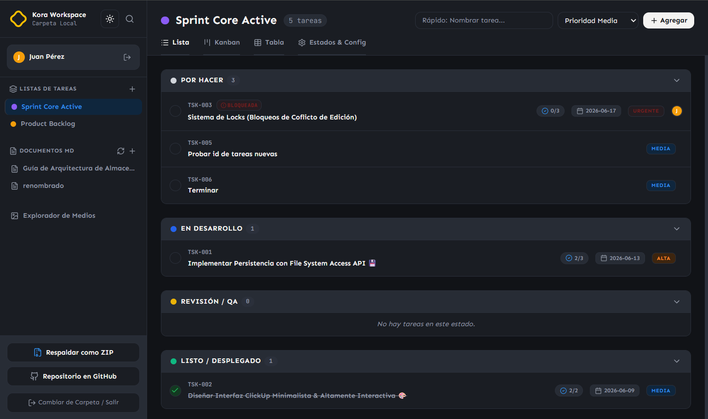

 ****
---


> ⚠️ **IMPORTANTE: PROYECTO EN ETAPA MUY TEMPRANA DE DESARROLLO** ⚠️ Este proyecto está en una fase inicial y **muchas funcionalidades aún no están implementadas o no funcionan correctamente**. Por favor, ten en cuenta esto al usar Kora.

Kora es el lugar donde los proyectos encuentran un hogar permanente. No depende de servidores externos ni de suscripciones para existir. Es una herramienta construida sobre una idea simple: el trabajo y los datos pertenecen a quienes los crean.



## Principios de Kora
- Offline first.
- No depende de servidores externos ni de suscripciones para existir.
- El trabajo y los datos pertenecen a quienes los crean.
- El formato de almacenamiento debe ser legible por humanos.
- Evitar dependencias propietarias.
- La estructura de archivos debe poder abrirse y modificarse con herramientas externas.

## Demostración en vivo
[kora.lorspi.com](https://kora.lorspi.com)

## Comienza a usar Kora

### Requisitos previos
- Node.js

### Instalación
1. Clona el repositorio
```bash
git clone https://github.com/lorspi/Kora.git
```
2. Instala las dependencias con:
```bash
npm install
```
3. Ejecuta el servidor de desarrollo con:
```bash
npm run dev
```

## Stack Tecnológico
- React 19
- TypeScript
- Vite
- Tailwind CSS
- Zustand
- Lucide React
- Motion
- Express

## Licencia
Kora está licenciado bajo la Licencia Apache 2.0. Ver el archivo [LICENSE](./LICENSE) para más detalles.

## Apoya apoya al creador
¿Te gusta mi proyecto? Invitame a un café

<a href="https://ko-fi.com/lorspi" target="_blank">
  
</a>

