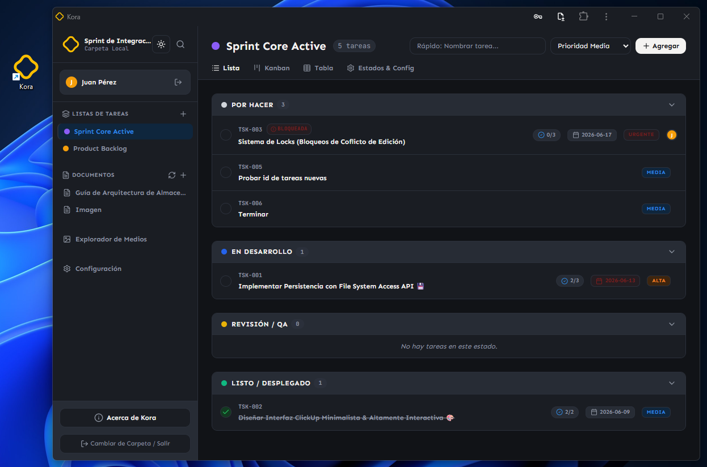

> ⚠️ **IMPORTANTE: PROYECTO EN ETAPA MUY TEMPRANA DE DESARROLLO** ⚠️
>
> Este proyecto está en una fase inicial y muchas funcionalidades aún no están implementadas o no funcionan correctamente. Si decides probarlo, ten en cuenta que el proyecto sigue evolucionando.

Kora es el lugar donde los proyectos encuentran un hogar permanente.

No depende de servidores externos ni de suscripciones para existir. Es una herramienta construida sobre una idea simple: **el trabajo y los datos pertenecen a quienes los crean**.

Pero Kora también nace con otra convicción: **la productividad no necesita estar saturada de funcionalidades**.

En un mundo donde muchas herramientas intentan hacerlo todo, Kora busca hacer pocas cosas, pero hacerlas bien. Sin complejidad innecesaria, sin configuraciones interminables y sin perder el foco.



## Principios de Kora
- Offline first.
- El trabajo y los datos pertenecen a quienes los crean.
- No depende de servidores externos ni de suscripciones para existir.
- La simplicidad es una característica, no una limitación.
- El formato de almacenamiento debe ser legible por humanos.
- Evitar dependencias propietarias.
- La estructura de archivos debe poder abrirse y modificarse con herramientas externas.
- Cada nueva funcionalidad debe justificar su existencia.

## Lo que Kora no pretende ser

Kora no busca convertirse en:

- Una suite empresarial gigantesca.
- Una plataforma llena de módulos que nunca usarás.
- Una herramienta que requiera horas de configuración.
- Un ecosistema cerrado del que sea difícil salir.

Su objetivo es ser una herramienta objetiva, funcional y predecible que desaparezca en el fondo para que puedas concentrarte en tu trabajo.

## Demostración en vivo
[kora.lorspi.com](https://kora.lorspi.com)

## Comienza a usar Kora

### Requisitos previos
- Node.js

### Instalación
1. Clona el repositorio
```bash
git clone https://github.com/lorspi/Kora.git
cd Kora
```
2. Instala las dependencias con:
```bash
npm install
```
3. Ejecuta el servidor de desarrollo con:
```bash
npm run dev
```
4. Accede a la herramienta en tu servidor local: [localhost:8080](http://localhost:8080/)

## Stack Tecnológico
- React 19
- TypeScript
- Vite
- Tailwind CSS
- Zustand
- Lucide React
- Motion
- Express

## Licencia
Kora está licenciado bajo la Licencia Apache 2.0. Ver el archivo [LICENSE](./LICENSE) para más detalles.

## Apoya apoya al creador
¿Te gusta mi proyecto? Invitame a un café

<a href="https://ko-fi.com/lorspi" target="_blank">
  
</a>

